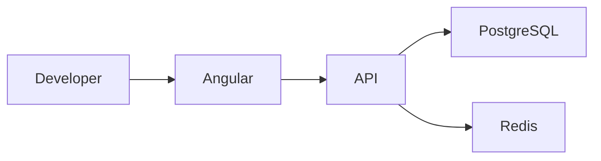
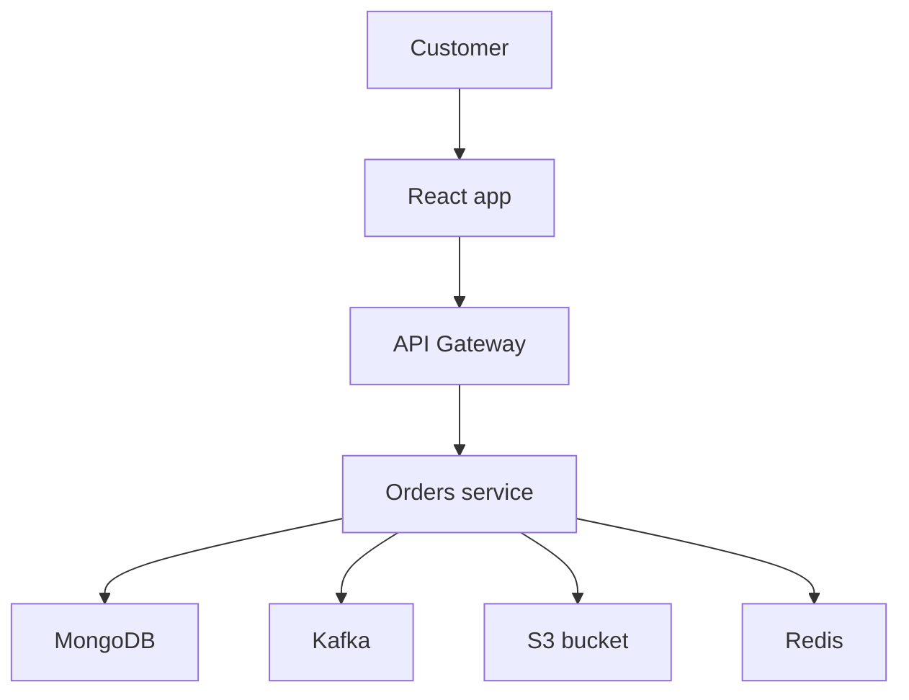
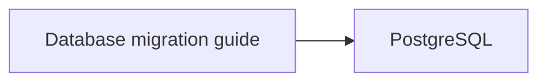
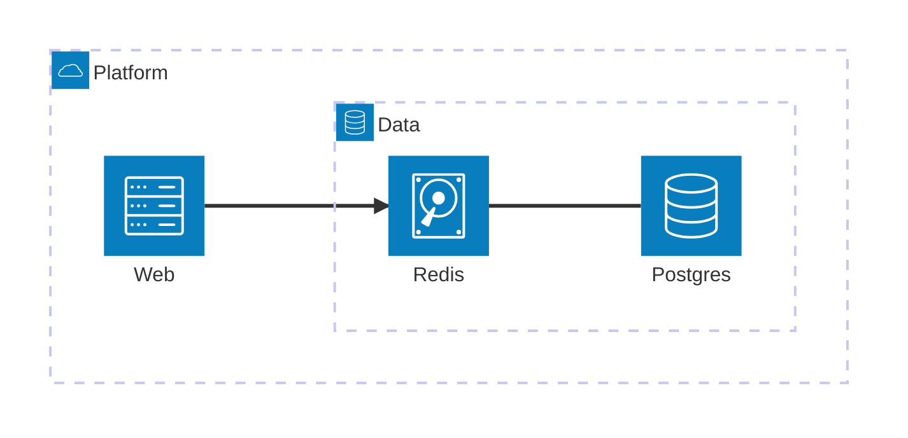

Every diagram on this page was generated in Node while the site was being built, and shipped as
markup. Open the source under any of them: the input is plain Mermaid.



Nobody annotated that. `PostgreSQL` is drawn as a database, `Redis` as a cache and `Developer` as a
person because [`docs-overlay-mermaid`](https://www.npmjs.com/package/docs-overlay-mermaid) reads the
labels and decides what each node _is_ before deciding what it looks like.

## Why not just use Mermaid

You can, and for many sites you should. Two things already work: ship the Mermaid bundle and render in
the reader's browser, or render at build time with `rehype-mermaid`, which drives a headless Chromium
through Playwright.

What neither does is produce an SVG at build time **without a browser**. This site is a static export
where Shiki runs at build time and no highlighter reaches the reader; a diagram renderer that needed a
browser — at build time or in the page — would be the one exception. So:

- no JavaScript reaches the reader, and no Chromium is installed in CI;
- no network request happens while rendering, ever;
- the same source always produces the same bytes, so a rebuild that changed nothing has an empty diff.

## Install

```bash
npm install docs-overlay-mermaid
```

You do not need `mermaid`. It is a standalone package: it does **not** depend on `docs-overlay` and
knows nothing about versioned documentation. It lives in the same repository to share the build, the
release and the test suite.

```ts
import { renderMermaid } from "docs-overlay-mermaid";

const { svg, width, height } = await renderMermaid(source, { theme: "technical" });
```

Parsing is asynchronous because `architecture-beta` goes through Mermaid's own Langium grammar, which
returns a promise. Everything after it — the semantic pass, the layout, the rendering — is synchronous
and pure.

## How this page does it

Two files. A remark plugin that replaces a fenced `mermaid` block with a pre-rendered component:

```ts
// apps/docs/lib/remark-diagram.ts
const { svg, width, height } = await renderMermaid(fence.source, { theme: "technical" });
```

and a server component that puts the string in the tree. It has to be a _remark_ plugin rather than a
rehype one: by the time rehype runs, Shiki has already turned the fence into styled spans and the raw
Mermaid source is gone.

Then the component is named in the MDX map, next to the ones Fumadocs provides:

```tsx
<MDX components={{ ...defaultMdxComponents, a: createRelativeLink(source, page), Diagram }} />
```

## What a node is

The semantic type is resolved in a fixed order, and the order is the contract:

1. **What the source states.** `service db(database)[Store]` is a database whatever its label says.
2. **Your rules.**
3. **The defaults** — `Postgres`, `Redis`, `Kafka`, `GraphQL`, `Angular`, `Developer`, and so on.
4. **`unknown`**, which is always drawn, never dropped.



The defaults match on word boundaries, and they abstain on a label that reads like prose. "Database
migration guide" is a documentation page, not a database:



Drawing a disk beside that first box would be worse than drawing nothing, because a reader trusts an
icon more than they re-read a label. The cost is a false negative on a node genuinely called
"Migration service", which one rule fixes:

```ts
await renderMermaid(source, {
  semantic: {
    rules: [{ match: node => node.id === "payments", type: "service", icon: "credit-card" }]
  }
});
```

## Architecture diagrams

`architecture-beta` is parsed by Mermaid's own grammar, so a diagram written against Mermaid renders
here unchanged — including the icon names it ships.



`web:R --> L:cache` says the edge leaves `web`'s right side, which means `cache` sits to its right.
That is a placement constraint, and honouring it is why these diagrams do not go through dagre: dagre
ranks by edge direction and has nowhere to put a side. Mermaid feeds the hints to a force-directed
engine instead, which looks good and is not reproducible — the same source can come out different
twice. A grid solved from the hints is both simpler and deterministic.

## Themes

Two themes ship. Every diagram on this page uses `technical`, which is flat: hairline borders, no
shadow, an accent stripe carrying the semantic type. `illustrated` draws the same diagram as cards —
the icon on a tinted plate, a soft shadow, a wider radius, more air:

```ts
await renderMermaid(source, { theme: "illustrated" });
```

Either way, every colour is read through a CSS custom property with the theme value as its fallback, so
this site restyles diagrams it did not generate:

```css
:root {
  --docs-overlay-diagram-node-bg: #fff;
  --docs-overlay-diagram-node-border: #e2e8f0;
  --docs-overlay-diagram-fg: #1f2933;
  --docs-overlay-diagram-muted: #5c6b7a;
  --docs-overlay-diagram-edge: #94a3b8;
  --docs-overlay-diagram-accent: #2f6feb;
  --docs-overlay-diagram-group-bg: #f8fafc;
  --docs-overlay-diagram-group-border: #e2e8f0;
  --docs-overlay-diagram-bg: transparent;
}
```

A dark palette travels inside the SVG under `prefers-color-scheme: dark`, so a diagram opened straight
from disk is readable either way — and a site that sets the properties wins over it.

## What it covers, and what it does not

`architecture-beta` is complete. `flowchart` is a **documented subset**, because Mermaid has no
standalone flowchart parser: `@mermaid-js/parser` does not cover flowcharts, and the grammar inside
`mermaid` needs a DOM. The shapes, link kinds, labels, chains, subgraphs and classes are all there;
`style`, `linkStyle`, `click` and `%%{init}%%` are read and ignored, because none of them mean anything
without a browser. The
[package readme](https://github.com/hebus/docs-overlay/tree/main/packages/adapters/mermaid#readme)
lists the subset line by line.

`sequenceDiagram`, `classDiagram`, `stateDiagram` and `erDiagram` are not supported yet — each needs its
own parser. A diagram type it cannot render raises an error whose `code` distinguishes "recognised but
unsupported" from "not a diagram at all", so a caller can hand the first to something else:

```ts
await renderMermaid(source, {
  fallback: { render: source => ({ svg: asCodeBlock(source), width: 0, height: 0 }) }
});
```

That is what keeps `mermaid` — and its d3, cytoscape and katex — out of this package's dependencies.

## Accessibility

Every diagram carries `role="img"`, `aria-labelledby`, a `<title>` and a `<desc>`. Mermaid's own
`title` and `accDescr` are used when the source has them; otherwise the description is generated from
the relationships, because a drawing announced only as "image" tells a reader nothing when its whole
content is which box connects to which. The flowchart at the top of this page describes itself as
"Developer to Angular; Angular to REST API; REST API to PostgreSQL; REST API to Redis."

Nothing is drawn with `<foreignObject>`, which is how Mermaid wraps labels and the reason a Mermaid SVG
cannot be dropped into an ``, a PDF or a thumbnail.
